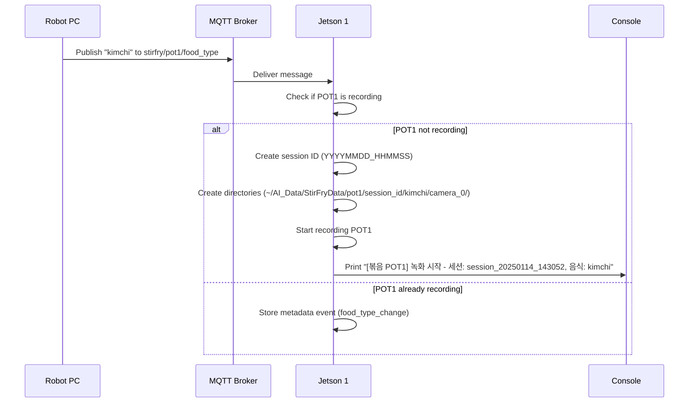
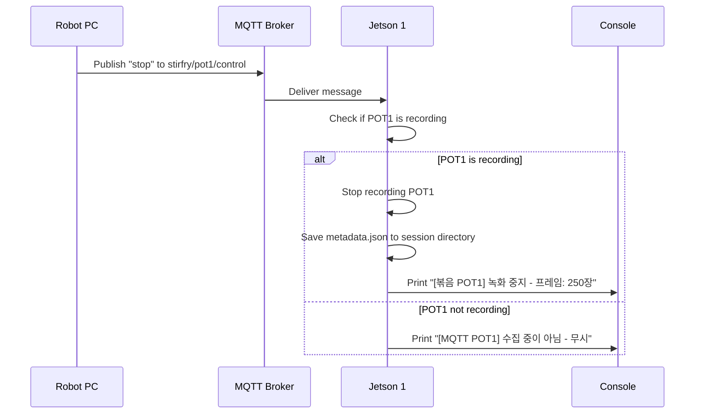

# MQTT Communication Documentation

## Overview

This system uses MQTT for communication between the Robot PC and two Jetson devices:
- **Jetson 1**: Stir-Fry Station (볶음 스테이션)
- **Jetson 2**: Frying Station (튀김 스테이션)

Each station has **2 independent cooking pots (POT1, POT2)** that can operate simultaneously or separately.

### Network Architecture

```
Robot PC (MQTT Publisher)
    ↓
MQTT Broker (localhost:1883)
    ↓
├── Jetson 1 (MQTT Subscriber + Publisher)
│   ├── POT1: Left Camera (camera_0)
│   └── POT2: Right Camera (camera_1)
│
└── Jetson 2 (MQTT Subscriber + Publisher)
    ├── POT1: Cameras 0 (frying left), 2 (observe left), 3 (observe right)
    └── POT2: Cameras 1 (frying right), 2 (observe left), 3 (observe right)
    Note: Observe cameras (2, 3) are shared - they save when either POT1 or POT2 is active
```

---

## MQTT Broker Configuration

- **Host**: `localhost`
- **Port**: `1883`
- **QoS**: `1` (At least once delivery)
- **Keep-Alive**: `60` seconds

---

## Jetson 1 (Stir-Fry Station) Topics

### Subscribed Topics (From Robot PC → Jetson 1)

Jetson 1 subscribes to 4 topics for pot1/pot2 control:

#### 1. `stirfry/pot1/food_type`
**Purpose**: Set food type for POT1 and **automatically start recording**

**Message Format**: Plain text string
```
"kimchi"
"bacon"
"mushroom"
"mixed_vegetables"
```

**Behavior**:
- If POT1 is not recording: **Auto-start recording** with this food type
- If POT1 is already recording: Store as metadata event (food type changed mid-session)

**Example**:
```bash
mosquitto_pub -h localhost -t "stirfry/pot1/food_type" -m "kimchi"
```

---

#### 2. `stirfry/pot1/control`
**Purpose**: Control POT1 recording (stop only)

**Message Format**: Plain text command
```
"stop"
```

**Behavior**:
- If POT1 is recording: **Auto-stop recording** and save metadata
- If POT1 is not recording: Ignore (no effect)

**Example**:
```bash
mosquitto_pub -h localhost -t "stirfry/pot1/control" -m "stop"
```

---

#### 3. `stirfry/pot2/food_type`
**Purpose**: Set food type for POT2 and **automatically start recording**

**Message Format**: Plain text string
```
"kimchi"
"bacon"
"mushroom"
"mixed_vegetables"
```

**Behavior**:
- If POT2 is not recording: **Auto-start recording** with this food type
- If POT2 is already recording: Store as metadata event (food type changed mid-session)

**Example**:
```bash
mosquitto_pub -h localhost -t "stirfry/pot2/food_type" -m "kimchi"
```

---

#### 4. `stirfry/pot2/control`
**Purpose**: Control POT2 recording (stop only)

**Message Format**: Plain text command
```
"stop"
```

**Behavior**:
- If POT2 is recording: **Auto-stop recording** and save metadata
- If POT2 is not recording: Ignore (no effect)

**Example**:
```bash
mosquitto_pub -h localhost -t "stirfry/pot2/control" -m "stop"
```

---

### Published Topics (From Jetson 1 → Robot PC)

#### 1. `jetson1/system/ai_mode`
**Purpose**: Publish current AI mode status

**Message Format**: Boolean string
```
"true"   # AI system is ready/complete
"false"  # AI system is not ready
```

**Publish Interval**: Every 2 seconds (configurable via `mqtt_publish_interval`)

---

### SSR/GPIO Control (Jetson 1 Only)

**Hardware**: GPIO Pin 7 (BOARD mode) controls SSR relay to power Robot PC on/off

**Day Mode Logic** (07:30 - 19:30, configurable via `day_start`/`day_end`):
1. Person detected for **2 seconds** (YOLO) → GPIO HIGH (SSR ON) → Robot PC powers on
2. MQTT publishes "robot/control" → "ON"
3. **SSR stays ON until night mode** (once triggered, remains on)

**Night Mode Logic** (19:30 - 07:30):
1. Switches to night mode at 19:30
2. **No person detected for 10 minutes** (configurable via `night_check_minutes`) → GPIO LOW (SSR OFF) → Robot PC powers off
3. MQTT publishes "robot/control" → "OFF"
4. After SSR OFF, motion detection saves snapshots only (no GPIO control)

**Important Notes**:
- Detection threshold: 2 seconds (configurable via `detection_hold_sec`)
- Night check timeout: 10 minutes (configurable via `night_check_minutes`)
- SSR control is independent of MQTT (both execute simultaneously)
- See `GPIO_SSR_연결가이드.md` for hardware setup

---

## Jetson 2 (Frying Station) Topics

### Subscribed Topics (From Robot PC → Jetson 2)

Jetson 2 subscribes to 4 topics for pot1/pot2 control + 4 temperature topics:

#### 1. `frying/pot1/food_type`
**Purpose**: Set food type for POT1 and **automatically start data collection**

**Message Format**: Plain text string
```
"chicken"
"shrimp"
"potato"
"dumpling"
"pork_cutlet"
"fish"
```

**Behavior**:
- If POT1 is not collecting: **Auto-start collection** with this food type
- If POT1 is already collecting: Store as metadata event

**Example**:
```bash
mosquitto_pub -h localhost -t "frying/pot1/food_type" -m "chicken"
```

---

#### 2. `frying/pot1/control`
**Purpose**: Control POT1 data collection (stop only)

**Message Format**: Plain text command
```
"stop"
```

**Behavior**:
- If POT1 is collecting: **Auto-stop collection** and save metadata
- If POT1 is not collecting: Ignore

**Example**:
```bash
mosquitto_pub -h localhost -t "frying/pot1/control" -m "stop"
```

---

#### 3. `frying/pot2/food_type`
**Purpose**: Set food type for POT2 and **automatically start data collection**

**Message Format**: Plain text string
```
"chicken"
"shrimp"
"potato"
"dumpling"
"pork_cutlet"
"fish"
```

**Behavior**:
- If POT2 is not collecting: **Auto-start collection** with this food type
- If POT2 is already collecting: Store as metadata event

**Example**:
```bash
mosquitto_pub -h localhost -t "frying/pot2/food_type" -m "chicken"
```

---

#### 4. `frying/pot2/control`
**Purpose**: Control POT2 data collection (stop only)

**Message Format**: Plain text command
```
"stop"
```

**Behavior**:
- If POT2 is collecting: **Auto-stop collection** and save metadata
- If POT2 is not collecting: Ignore

**Example**:
```bash
mosquitto_pub -h localhost -t "frying/pot2/control" -m "stop"
```

---

#### 5. `frying/pot1/oil_temp`
**Purpose**: Receive oil temperature from POT1

**Message Format**: Float number (Celsius)
```
"165.5"
"180.0"
```

**Behavior**: Stored in POT1 metadata if POT1 collection is active

---

#### 6. `frying/pot1/probe_temp`
**Purpose**: Receive probe (food core) temperature from POT1

**Message Format**: Float number (Celsius)
```
"65.0"
"75.0"
```

**Behavior**:
- Stored in POT1 metadata if POT1 collection is active
- Auto-mark POT1 completion when >= 75.0°C (target temperature)

---

#### 7. `frying/pot2/oil_temp`
**Purpose**: Receive oil temperature from POT2

**Message Format**: Float number (Celsius)
```
"170.2"
"185.0"
```

**Behavior**: Stored in POT2 metadata if POT2 collection is active

---

#### 8. `frying/pot2/probe_temp`
**Purpose**: Receive probe (food core) temperature from POT2

**Message Format**: Float number (Celsius)
```
"70.5"
"75.0"
```

**Behavior**:
- Stored in POT2 metadata if POT2 collection is active
- Auto-mark POT2 completion when >= 75.0°C (target temperature)

---

### Published Topics (From Jetson 2 → Robot PC)

#### 1. `jetson2/system/ai_mode`
**Purpose**: Publish current AI mode status

**Message Format**: Boolean string
```
"true"   # AI system is ready/complete
"false"  # AI system is not ready
```

**Publish Interval**: Every 2 seconds

---

#### 2. `jetson2/frying/status`
**Purpose**: Publish frying AI inference results

**Message Format**: JSON or custom format
```
"LEFT:empty,RIGHT:filled"
```

**Publish Interval**: Every 2 seconds

---

#### 3. `jetson2/observe/status`
**Purpose**: Publish observe (bucket) AI inference results

**Message Format**: JSON or custom format
```
"LEFT:filled,RIGHT:empty"
```

**Publish Interval**: Every 2 seconds

---

## Control Flow

### Starting Data Collection (Auto-Start)



### Stopping Data Collection (Auto-Stop)



---

## Data Storage Structure

### Jetson 1 (Stir-Fry)

```
~/AI_Data/StirFryData/
├── pot1/
│   └── session_20250114_143052/
│       └── kimchi/
│           ├── camera_0/
│           │   ├── camera_0_143052_123.jpg
│           │   ├── camera_0_143055_456.jpg
│           │   └── ...
│           └── metadata.json
└── pot2/
    └── session_20250114_143100/
        └── bacon/
            ├── camera_1/
            │   ├── camera_1_143100_789.jpg
            │   ├── camera_1_143103_012.jpg
            │   └── ...
            └── metadata.json
```

### Jetson 2 (Frying)

```
~/AI_Data/FryingData/
├── pot1/
│   └── session_20250114_143052/
│       └── chicken/
│           ├── camera_0/  (frying left - POT1 main camera)
│           │   ├── camera_0_143052_123.jpg
│           │   └── ...
│           ├── camera_2/  (observe left - shared)
│           │   ├── camera_2_143052_123.jpg
│           │   └── ...
│           ├── camera_3/  (observe right - shared)
│           │   ├── camera_3_143052_123.jpg
│           │   └── ...
│           └── session_info.json
└── pot2/
    └── session_20250114_143100/
        └── shrimp/
            ├── camera_1/  (frying right - POT2 main camera)
            │   ├── camera_1_143100_789.jpg
            │   └── ...
            ├── camera_2/  (observe left - shared)
            │   ├── camera_2_143100_789.jpg
            │   └── ...
            ├── camera_3/  (observe right - shared)
            │   ├── camera_3_143100_789.jpg
            │   └── ...
            └── session_info.json
```

**Note**: Observe cameras (camera_2, camera_3) are saved for both POT1 and POT2 sessions. When either pot is active, both observe cameras record data to that pot's session directory.

---

## Metadata JSON Format

### Jetson 1 (Stir-Fry) - metadata.json

```json
{
  "pot": "pot1",
  "session_id": "session_20250114_143052",
  "food_type": "kimchi",
  "start_time": "2025-01-14 14:30:52",
  "end_time": "2025-01-14 14:35:20",
  "duration_seconds": 268.5,
  "frame_count": 250,
  "resolution": {
    "width": 1280,
    "height": 720
  },
  "jpeg_quality": 100,
  "frame_skip": 90,
  "device_id": "jetson1",
  "device_name": "Jetson1_StirFry_Station",
  "camera": "camera_0",
  "events": [
    {
      "timestamp": "2025-01-14 14:30:52.123",
      "type": "session_start",
      "session_id": "session_20250114_143052",
      "food_type": "kimchi"
    },
    {
      "timestamp": "2025-01-14 14:35:20.456",
      "type": "session_end",
      "duration_seconds": 268.5,
      "frame_count": 250
    }
  ]
}
```

### Jetson 2 (Frying) - session_info.json

```json
{
  "pot": "pot1",
  "session_id": "session_20250114_143052",
  "food_type": "chicken",
  "start_time": "2025-01-14 14:30:52",
  "end_time": "2025-01-14 14:35:20",
  "duration_sec": 268.5,
  "collection_interval": 3,
  "completion_marked": true,
  "completion_info": {
    "method": "auto (probe_temp >= 75.0°C)",
    "timestamp": "2025-01-14 14:34:15",
    "probe_temp": 75.5,
    "oil_temp": 180.0,
    "elapsed_time_sec": 203.2
  },
  "cameras_used": [0, 2, 3],
  "total_frames_saved": 350,
  "raw_metadata": [
    {
      "timestamp": "2025-01-14 14:30:55.123",
      "type": "oil_temperature",
      "position": "left",
      "value": 165.5,
      "unit": "celsius"
    },
    {
      "timestamp": "2025-01-14 14:31:00.456",
      "type": "probe_temperature",
      "position": "left",
      "value": 45.0,
      "unit": "celsius"
    }
  ],
  "metadata_count": 125
}
```

---

## Configuration

### Jetson 1 Config (`jetson1_monitoring/config.json`)

```json
{
  "mqtt_enabled": false,
  "mqtt_broker": "localhost",
  "mqtt_port": 1883,
  "mqtt_topic_ai_mode": "jetson1/system/ai_mode",
  "mqtt_topic_stirfry_pot1_food_type": "stirfry/pot1/food_type",
  "mqtt_topic_stirfry_pot1_control": "stirfry/pot1/control",
  "mqtt_topic_stirfry_pot2_food_type": "stirfry/pot2/food_type",
  "mqtt_topic_stirfry_pot2_control": "stirfry/pot2/control",
  "mqtt_qos": 1,
  "mqtt_client_id": "jetson1_ai",
  "mqtt_publish_interval": 2,
  "stirfry_save_dir": "AI_Data/StirFryData",
  "stirfry_frame_skip": 90,
  "stirfry_jpeg_quality": 100
}
```

### Jetson 2 Config (`jetson2_frying_ai/config_jetson2.json`)

```json
{
  "mqtt_enabled": false,
  "mqtt_broker": "localhost",
  "mqtt_port": 1883,
  "mqtt_topic_frying_pot1_food_type": "frying/pot1/food_type",
  "mqtt_topic_frying_pot1_control": "frying/pot1/control",
  "mqtt_topic_frying_pot2_food_type": "frying/pot2/food_type",
  "mqtt_topic_frying_pot2_control": "frying/pot2/control",
  "mqtt_topic_pot1_oil_temp": "frying/pot1/oil_temp",
  "mqtt_topic_pot1_probe_temp": "frying/pot1/probe_temp",
  "mqtt_topic_pot2_oil_temp": "frying/pot2/oil_temp",
  "mqtt_topic_pot2_probe_temp": "frying/pot2/probe_temp",
  "mqtt_qos": 1,
  "mqtt_client_id": "jetson2_ai",
  "mqtt_publish_interval": 2,
  "data_collection_interval": 3,
  "jpeg_quality": 100,
  "target_probe_temp": 75.0
}
```

---

## Python Code Examples

### Publishing from Robot PC

```python
import paho.mqtt.client as mqtt
import time

# Connect to broker
client = mqtt.Client(client_id="robot_pc")
client.connect("localhost", 1883, 60)
client.loop_start()

# Start POT1 cooking kimchi
client.publish("stirfry/pot1/food_type", "kimchi", qos=1)
print("Started POT1 with kimchi")

# Wait for cooking
time.sleep(300)  # 5 minutes

# Stop POT1
client.publish("stirfry/pot1/control", "stop", qos=1)
print("Stopped POT1")

client.loop_stop()
client.disconnect()
```

### Subscribing on Jetson (Built-in)

Jetson devices automatically subscribe when MQTT is enabled. Check logs:

```bash
# Jetson 1 logs
tail -f /var/log/jetson1-monitor.log

# Expected output:
# [MQTT POT1] 음식 종류 수신: kimchi
# [MQTT POT1] 자동 녹화 시작 - 음식: kimchi
# [볶음 POT1] 녹화 시작 - 세션: session_20250114_143052, 음식: kimchi
```

---

## Testing MQTT Topics

### Install Mosquitto Clients

```bash
sudo apt-get install mosquitto-clients
```

### Subscribe to All Topics (Monitor)

```bash
# Monitor all messages on broker
mosquitto_sub -h localhost -t "#" -v
```

### Test Jetson 1 POT1

```bash
# Terminal 1: Monitor all topics
mosquitto_sub -h localhost -t "#" -v

# Terminal 2: Send commands
mosquitto_pub -h localhost -t "stirfry/pot1/food_type" -m "kimchi"
sleep 5
mosquitto_pub -h localhost -t "stirfry/pot1/control" -m "stop"
```

### Test Jetson 2 POT1 with Temperature

```bash
# Terminal 1: Monitor
mosquitto_sub -h localhost -t "#" -v

# Terminal 2: Send commands
mosquitto_pub -h localhost -t "frying/pot1/food_type" -m "chicken"
mosquitto_pub -h localhost -t "frying/pot1/oil_temp" -m "165.5"
mosquitto_pub -h localhost -t "frying/pot1/probe_temp" -m "45.0"

# Wait a bit
sleep 2
mosquitto_pub -h localhost -t "frying/pot1/probe_temp" -m "75.5"  # Auto-mark completion

# Stop
mosquitto_pub -h localhost -t "frying/pot1/control" -m "stop"
```

---

## Troubleshooting

### MQTT Not Working

1. **Check MQTT broker is running**:
```bash
sudo systemctl status mosquitto
sudo systemctl start mosquitto  # If not running
```

2. **Check config file has `mqtt_enabled: true`**:
```bash
cat ~/jetson-food-ai/jetson1_monitoring/config.json | grep mqtt_enabled
# Should show: "mqtt_enabled": true
```

3. **Check network connectivity**:
```bash
mosquitto_sub -h localhost -t test -v
# In another terminal:
mosquitto_pub -h localhost -t test -m "hello"
# Should see: test hello
```

4. **Check Jetson logs**:
```bash
# Jetson 1
journalctl -u jetson1-monitor.service -f

# Jetson 2
journalctl -u jetson2-frying-ai.service -f
```

### Recording Not Starting

1. **Check MQTT is enabled** in config
2. **Verify topic name** matches exactly (case-sensitive)
3. **Check food_type message** is valid string (not empty)
4. **View Python logs** for error messages

### Data Not Saving

1. **Check directory permissions**:
```bash
ls -la ~/AI_Data/
# Should be owned by current user
```

2. **Check disk space**:
```bash
df -h ~
# Should have sufficient space (>10GB recommended)
```

3. **Check frame skip settings**:
```bash
cat config.json | grep frame_skip
# Default: 90 (saves 1 frame every 3 seconds at 30fps)
```

---

## Important Notes

### QoS Level
- **QoS 1** (At least once): Ensures message delivery even if network is unstable
- Messages may be delivered more than once (duplicates handled by Jetson)

### Message Retention
- Messages are **not retained** by default
- If Jetson is offline when message is sent, it will be **missed**
- Solution: Implement heartbeat monitoring on Robot PC

### Timing Considerations
- **Auto-start delay**: < 100ms from message receipt
- **Frame save interval**: 3 seconds (Jetson 2) or 90 frames (Jetson 1)
- **MQTT publish interval**: 2 seconds (configurable)

### Concurrent Operations
- **POT1 and POT2 can operate simultaneously**
- Each pot has independent session ID and metadata
- No interference between pots

### Storage Estimates
- **JPEG Quality 100**: ~800KB per image
- **Frame skip 90** (Jetson 1): ~1 image per 3 seconds
- **5-minute cooking session**: ~100 images = ~80MB per camera
- **Daily estimate** (10 sessions): ~800MB per camera

---

## Quick Reference Card

### Start Recording/Collection

| Device | Pot | Topic | Message |
|--------|-----|-------|---------|
| Jetson 1 | POT1 | `stirfry/pot1/food_type` | `"kimchi"` |
| Jetson 1 | POT2 | `stirfry/pot2/food_type` | `"bacon"` |
| Jetson 2 | POT1 | `frying/pot1/food_type` | `"chicken"` |
| Jetson 2 | POT2 | `frying/pot2/food_type` | `"shrimp"` |

### Stop Recording/Collection

| Device | Pot | Topic | Message |
|--------|-----|-------|---------|
| Jetson 1 | POT1 | `stirfry/pot1/control` | `"stop"` |
| Jetson 1 | POT2 | `stirfry/pot2/control` | `"stop"` |
| Jetson 2 | POT1 | `frying/pot1/control` | `"stop"` |
| Jetson 2 | POT2 | `frying/pot2/control` | `"stop"` |

### Temperature Data (Jetson 2 Only)

| Topic | Purpose | Format |
|-------|---------|--------|
| `frying/pot1/oil_temp` | POT1 oil temp | `"165.5"` |
| `frying/pot1/probe_temp` | POT1 food core temp | `"75.0"` |
| `frying/pot2/oil_temp` | POT2 oil temp | `"170.0"` |
| `frying/pot2/probe_temp` | POT2 food core temp | `"75.5"` |

---

## Contact & Support

For deployment issues:
1. Check this documentation first
2. Review Jetson logs: `journalctl -u jetson*-*.service -f`
3. Test MQTT with mosquitto_pub/sub commands
4. Verify config files have correct settings

---

**Document Version**: 1.0
**Last Updated**: 2025-01-14
**Compatible with**: Jetson Software v2.0 (POT1/POT2 separation)

