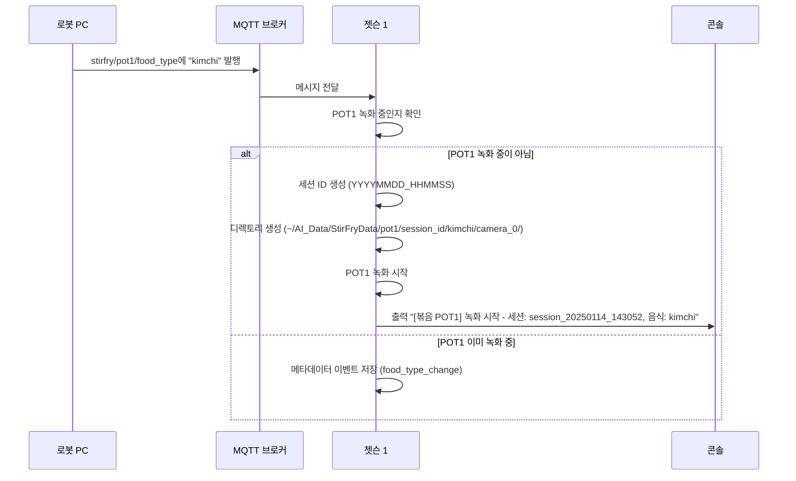
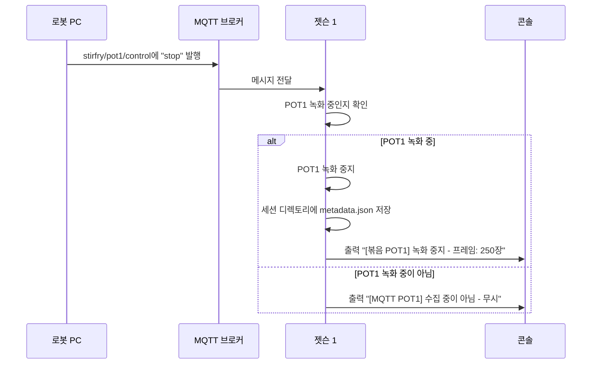

# MQTT 통신 문서

## 개요

이 시스템은 로봇 PC와 두 대의 젯슨 장치 간 통신을 위해 MQTT를 사용합니다:
- **젯슨 1**: 볶음 스테이션
- **젯슨 2**: 튀김 스테이션

각 스테이션은 **2개의 독립적인 조리 솥 (POT1, POT2)**을 가지고 있으며, 동시 또는 개별 작동이 가능합니다.

### 네트워크 구조

```
로봇 PC (MQTT 발행자)
    ↓
MQTT 브로커 (localhost:1883)
    ↓
├── 젯슨 1 (MQTT 구독자 + 발행자)
│   ├── POT1: 왼쪽 카메라 (camera_0)
│   └── POT2: 오른쪽 카메라 (camera_1)
│
└── 젯슨 2 (MQTT 구독자 + 발행자)
    ├── POT1: 카메라 0,1 (튀김 왼쪽/오른쪽)
    └── POT2: 카메라 2,3 (관찰 왼쪽/오른쪽)
```

---

## MQTT 브로커 설정

- **호스트**: `localhost`
- **포트**: `1883`
- **QoS**: `1` (최소 1회 전달)
- **Keep-Alive**: `60`초

---

## 젯슨 1 (볶음 스테이션) 토픽

### 구독 토픽 (로봇 PC → 젯슨 1)

젯슨 1은 pot1/pot2 제어를 위해 4개의 토픽을 구독합니다:

#### 1. `stirfry/pot1/food_type`
**목적**: POT1의 음식 종류 설정 및 **자동 녹화 시작**

**메시지 형식**: 일반 텍스트 문자열
```
"kimchi"
"bacon"
"mushroom"
"mixed_vegetables"
```

**동작**:
- POT1이 녹화 중이 아닌 경우: 해당 음식 종류로 **자동 녹화 시작**
- POT1이 이미 녹화 중인 경우: 메타데이터 이벤트로 저장 (세션 중 음식 종류 변경)

**예시**:
```bash
mosquitto_pub -h localhost -t "stirfry/pot1/food_type" -m "kimchi"
```

---

#### 2. `stirfry/pot1/control`
**목적**: POT1 녹화 제어 (중지만 가능)

**메시지 형식**: 일반 텍스트 명령
```
"stop"
```

**동작**:
- POT1이 녹화 중인 경우: **자동 녹화 중지** 및 메타데이터 저장
- POT1이 녹화 중이 아닌 경우: 무시 (영향 없음)

**예시**:
```bash
mosquitto_pub -h localhost -t "stirfry/pot1/control" -m "stop"
```

---

#### 3. `stirfry/pot2/food_type`
**목적**: POT2의 음식 종류 설정 및 **자동 녹화 시작**

**메시지 형식**: 일반 텍스트 문자열
```
"kimchi"
"bacon"
"mushroom"
"mixed_vegetables"
```

**동작**:
- POT2가 녹화 중이 아닌 경우: 해당 음식 종류로 **자동 녹화 시작**
- POT2가 이미 녹화 중인 경우: 메타데이터 이벤트로 저장 (세션 중 음식 종류 변경)

**예시**:
```bash
mosquitto_pub -h localhost -t "stirfry/pot2/food_type" -m "kimchi"
```

---

#### 4. `stirfry/pot2/control`
**목적**: POT2 녹화 제어 (중지만 가능)

**메시지 형식**: 일반 텍스트 명령
```
"stop"
```

**동작**:
- POT2가 녹화 중인 경우: **자동 녹화 중지** 및 메타데이터 저장
- POT2가 녹화 중이 아닌 경우: 무시 (영향 없음)

**예시**:
```bash
mosquitto_pub -h localhost -t "stirfry/pot2/control" -m "stop"
```

---

### 발행 토픽 (젯슨 1 → 로봇 PC)

#### 1. `jetson1/system/ai_mode`
**목적**: 현재 AI 모드 상태 발행

**메시지 형식**: 불리언 문자열
```
"true"   # AI 시스템 준비 완료
"false"  # AI 시스템 준비 안됨
```

**발행 주기**: 2초마다 (`mqtt_publish_interval`로 설정 가능)

---

## 젯슨 2 (튀김 스테이션) 토픽

### 구독 토픽 (로봇 PC → 젯슨 2)

젯슨 2는 pot1/pot2 제어를 위한 4개 토픽 + 온도 토픽 4개를 구독합니다:

#### 1. `frying/pot1/food_type`
**목적**: POT1의 음식 종류 설정 및 **자동 데이터 수집 시작**

**메시지 형식**: 일반 텍스트 문자열
```
"chicken"
"shrimp"
"potato"
"dumpling"
"pork_cutlet"
"fish"
```

**동작**:
- POT1이 수집 중이 아닌 경우: 해당 음식 종류로 **자동 수집 시작**
- POT1이 이미 수집 중인 경우: 메타데이터 이벤트로 저장

**예시**:
```bash
mosquitto_pub -h localhost -t "frying/pot1/food_type" -m "chicken"
```

---

#### 2. `frying/pot1/control`
**목적**: POT1 데이터 수집 제어 (중지만 가능)

**메시지 형식**: 일반 텍스트 명령
```
"stop"
```

**동작**:
- POT1이 수집 중인 경우: **자동 수집 중지** 및 메타데이터 저장
- POT1이 수집 중이 아닌 경우: 무시

**예시**:
```bash
mosquitto_pub -h localhost -t "frying/pot1/control" -m "stop"
```

---

#### 3. `frying/pot2/food_type`
**목적**: POT2의 음식 종류 설정 및 **자동 데이터 수집 시작**

**메시지 형식**: 일반 텍스트 문자열
```
"chicken"
"shrimp"
"potato"
"dumpling"
"pork_cutlet"
"fish"
```

**동작**:
- POT2가 수집 중이 아닌 경우: 해당 음식 종류로 **자동 수집 시작**
- POT2가 이미 수집 중인 경우: 메타데이터 이벤트로 저장

**예시**:
```bash
mosquitto_pub -h localhost -t "frying/pot2/food_type" -m "chicken"
```

---

#### 4. `frying/pot2/control`
**목적**: POT2 데이터 수집 제어 (중지만 가능)

**메시지 형식**: 일반 텍스트 명령
```
"stop"
```

**동작**:
- POT2가 수집 중인 경우: **자동 수집 중지** 및 메타데이터 저장
- POT2가 수집 중이 아닌 경우: 무시

**예시**:
```bash
mosquitto_pub -h localhost -t "frying/pot2/control" -m "stop"
```

---

#### 5. `frying/oil_temp/left`
**목적**: 왼쪽 솥의 기름 온도 수신

**메시지 형식**: 실수 (섭씨)
```
"165.5"
"180.0"
```

**동작**: 수집 활성화 시 메타데이터에 저장됨

---

#### 6. `frying/oil_temp/right`
**목적**: 오른쪽 솥의 기름 온도 수신

**메시지 형식**: 실수 (섭씨)
```
"170.2"
"185.0"
```

**동작**: 수집 활성화 시 메타데이터에 저장됨

---

#### 7. `frying/probe_temp/left`
**목적**: 왼쪽 솥의 탐침(음식 중심부) 온도 수신

**메시지 형식**: 실수 (섭씨)
```
"65.0"
"75.0"
```

**동작**:
- 수집 활성화 시 메타데이터에 저장됨
- 75.0°C 이상일 때 자동 완료 마킹 (목표 온도)

---

#### 8. `frying/probe_temp/right`
**목적**: 오른쪽 솥의 탐침(음식 중심부) 온도 수신

**메시지 형식**: 실수 (섭씨)
```
"70.5"
"75.0"
```

**동작**:
- 수집 활성화 시 메타데이터에 저장됨
- 75.0°C 이상일 때 자동 완료 마킹 (목표 온도)

---

### 발행 토픽 (젯슨 2 → 로봇 PC)

#### 1. `jetson2/system/ai_mode`
**목적**: 현재 AI 모드 상태 발행

**메시지 형식**: 불리언 문자열
```
"true"   # AI 시스템 준비 완료
"false"  # AI 시스템 준비 안됨
```

**발행 주기**: 2초마다

---

#### 2. `jetson2/frying/status`
**목적**: 튀김 AI 추론 결과 발행

**메시지 형식**: JSON 또는 커스텀 형식
```
"LEFT:empty,RIGHT:filled"
```

**발행 주기**: 2초마다

---

#### 3. `jetson2/observe/status`
**목적**: 관찰(바구니) AI 추론 결과 발행

**메시지 형식**: JSON 또는 커스텀 형식
```
"LEFT:filled,RIGHT:empty"
```

**발행 주기**: 2초마다

---

## 제어 흐름

### 데이터 수집 시작 (자동 시작)



### 데이터 수집 중지 (자동 중지)



---

## 데이터 저장 구조

### 젯슨 1 (볶음)

```
~/AI_Data/StirFryData/
├── pot1/
│   └── session_20250114_143052/
│       └── kimchi/
│           ├── camera_0/
│           │   ├── camera_0_143052_123.jpg
│           │   ├── camera_0_143055_456.jpg
│           │   └── ...
│           └── metadata.json
└── pot2/
    └── session_20250114_143100/
        └── bacon/
            ├── camera_1/
            │   ├── camera_1_143100_789.jpg
            │   ├── camera_1_143103_012.jpg
            │   └── ...
            └── metadata.json
```

### 젯슨 2 (튀김)

```
~/AI_Data/FryingData/
├── pot1/
│   └── session_20250114_143052/
│       └── chicken/
│           ├── camera_0/
│           │   ├── camera_0_143052_123.jpg
│           │   └── ...
│           ├── camera_1/
│           │   ├── camera_1_143052_123.jpg
│           │   └── ...
│           └── session_info.json
└── pot2/
    └── session_20250114_143100/
        └── shrimp/
            ├── camera_2/
            │   ├── camera_2_143100_789.jpg
            │   └── ...
            ├── camera_3/
            │   ├── camera_3_143100_789.jpg
            │   └── ...
            └── session_info.json
```

---

## 메타데이터 JSON 형식

### 젯슨 1 (볶음) - metadata.json

```json
{
  "pot": "pot1",
  "session_id": "session_20250114_143052",
  "food_type": "kimchi",
  "start_time": "2025-01-14 14:30:52",
  "end_time": "2025-01-14 14:35:20",
  "duration_seconds": 268.5,
  "frame_count": 250,
  "resolution": {
    "width": 1280,
    "height": 720
  },
  "jpeg_quality": 100,
  "frame_skip": 90,
  "device_id": "jetson1",
  "device_name": "Jetson1_StirFry_Station",
  "camera": "camera_0",
  "events": [
    {
      "timestamp": "2025-01-14 14:30:52.123",
      "type": "session_start",
      "session_id": "session_20250114_143052",
      "food_type": "kimchi"
    },
    {
      "timestamp": "2025-01-14 14:35:20.456",
      "type": "session_end",
      "duration_seconds": 268.5,
      "frame_count": 250
    }
  ]
}
```

### 젯슨 2 (튀김) - session_info.json

```json
{
  "pot": "pot1",
  "session_id": "session_20250114_143052",
  "food_type": "chicken",
  "start_time": "2025-01-14 14:30:52",
  "end_time": "2025-01-14 14:35:20",
  "duration_sec": 268.5,
  "collection_interval": 3,
  "completion_marked": true,
  "completion_info": {
    "method": "auto (probe_temp >= 75.0°C)",
    "timestamp": "2025-01-14 14:34:15",
    "probe_temp": 75.5,
    "oil_temp": 180.0,
    "elapsed_time_sec": 203.2
  },
  "cameras_used": [0, 1],
  "total_frames_saved": 350,
  "raw_metadata": [
    {
      "timestamp": "2025-01-14 14:30:55.123",
      "type": "oil_temperature",
      "position": "left",
      "value": 165.5,
      "unit": "celsius"
    },
    {
      "timestamp": "2025-01-14 14:31:00.456",
      "type": "probe_temperature",
      "position": "left",
      "value": 45.0,
      "unit": "celsius"
    }
  ],
  "metadata_count": 125
}
```

---

## 설정

### 젯슨 1 설정 (`jetson1_monitoring/config.json`)

```json
{
  "mqtt_enabled": false,
  "mqtt_broker": "localhost",
  "mqtt_port": 1883,
  "mqtt_topic_ai_mode": "jetson1/system/ai_mode",
  "mqtt_topic_stirfry_pot1_food_type": "stirfry/pot1/food_type",
  "mqtt_topic_stirfry_pot1_control": "stirfry/pot1/control",
  "mqtt_topic_stirfry_pot2_food_type": "stirfry/pot2/food_type",
  "mqtt_topic_stirfry_pot2_control": "stirfry/pot2/control",
  "mqtt_qos": 1,
  "mqtt_client_id": "jetson1_ai",
  "mqtt_publish_interval": 2,
  "stirfry_save_dir": "AI_Data/StirFryData",
  "stirfry_frame_skip": 90,
  "stirfry_jpeg_quality": 100
}
```

### 젯슨 2 설정 (`jetson2_frying_ai/config_jetson2.json`)

```json
{
  "mqtt_enabled": false,
  "mqtt_broker": "localhost",
  "mqtt_port": 1883,
  "mqtt_topic_frying_pot1_food_type": "frying/pot1/food_type",
  "mqtt_topic_frying_pot1_control": "frying/pot1/control",
  "mqtt_topic_frying_pot2_food_type": "frying/pot2/food_type",
  "mqtt_topic_frying_pot2_control": "frying/pot2/control",
  "mqtt_topic_oil_temp_left": "frying/oil_temp/left",
  "mqtt_topic_oil_temp_right": "frying/oil_temp/right",
  "mqtt_topic_probe_temp_left": "frying/probe_temp/left",
  "mqtt_topic_probe_temp_right": "frying/probe_temp/right",
  "mqtt_qos": 1,
  "mqtt_client_id": "jetson2_ai",
  "mqtt_publish_interval": 2,
  "data_collection_interval": 3,
  "jpeg_quality": 100,
  "target_probe_temp": 75.0
}
```

---

## Python 코드 예제

### 로봇 PC에서 발행하기

```python
import paho.mqtt.client as mqtt
import time

# 브로커에 연결
client = mqtt.Client(client_id="robot_pc")
client.connect("localhost", 1883, 60)
client.loop_start()

# POT1로 김치 조리 시작
client.publish("stirfry/pot1/food_type", "kimchi", qos=1)
print("Started POT1 with kimchi")

# 조리 대기
time.sleep(300)  # 5분

# POT1 중지
client.publish("stirfry/pot1/control", "stop", qos=1)
print("Stopped POT1")

client.loop_stop()
client.disconnect()
```

### 젯슨에서 구독하기 (내장)

젯슨 장치는 MQTT가 활성화되면 자동으로 구독합니다. 로그 확인:

```bash
# 젯슨 1 로그
tail -f /var/log/jetson1-monitor.log

# 예상 출력:
# [MQTT POT1] 음식 종류 수신: kimchi
# [MQTT POT1] 자동 녹화 시작 - 음식: kimchi
# [볶음 POT1] 녹화 시작 - 세션: session_20250114_143052, 음식: kimchi
```

---

## MQTT 토픽 테스트

### Mosquitto 클라이언트 설치

```bash
sudo apt-get install mosquitto-clients
```

### 모든 토픽 구독 (모니터링)

```bash
# 브로커의 모든 메시지 모니터링
mosquitto_sub -h localhost -t "#" -v
```

### 젯슨 1 POT1 테스트

```bash
# 터미널 1: 모든 토픽 모니터링
mosquitto_sub -h localhost -t "#" -v

# 터미널 2: 명령 전송
mosquitto_pub -h localhost -t "stirfry/pot1/food_type" -m "kimchi"
sleep 5
mosquitto_pub -h localhost -t "stirfry/pot1/control" -m "stop"
```

### 젯슨 2 POT1 온도와 함께 테스트

```bash
# 터미널 1: 모니터링
mosquitto_sub -h localhost -t "#" -v

# 터미널 2: 명령 전송
mosquitto_pub -h localhost -t "frying/pot1/food_type" -m "chicken"
mosquitto_pub -h localhost -t "frying/oil_temp/left" -m "165.5"
mosquitto_pub -h localhost -t "frying/probe_temp/left" -m "45.0"

# 잠시 대기
sleep 2
mosquitto_pub -h localhost -t "frying/probe_temp/left" -m "75.5"  # 자동 완료 마킹

# 중지
mosquitto_pub -h localhost -t "frying/pot1/control" -m "stop"
```

---

## 문제 해결

### MQTT 작동 안 함

1. **MQTT 브로커 실행 확인**:
```bash
sudo systemctl status mosquitto
sudo systemctl start mosquitto  # 실행 중이 아닌 경우
```

2. **설정 파일에서 `mqtt_enabled: true` 확인**:
```bash
cat ~/jetson-food-ai/jetson1_monitoring/config.json | grep mqtt_enabled
# "mqtt_enabled": true 로 표시되어야 함
```

3. **네트워크 연결 확인**:
```bash
mosquitto_sub -h localhost -t test -v
# 다른 터미널에서:
mosquitto_pub -h localhost -t test -m "hello"
# "test hello" 가 보여야 함
```

4. **젯슨 로그 확인**:
```bash
# 젯슨 1
journalctl -u jetson1-monitor.service -f

# 젯슨 2
journalctl -u jetson2-frying-ai.service -f
```

### 녹화가 시작되지 않음

1. **설정에서 MQTT 활성화 확인**
2. **토픽 이름이 정확히 일치하는지 확인** (대소문자 구분)
3. **food_type 메시지가 유효한 문자열인지 확인** (빈 문자열 아님)
4. **Python 로그에서 오류 메시지 확인**

### 데이터가 저장되지 않음

1. **디렉토리 권한 확인**:
```bash
ls -la ~/AI_Data/
# 현재 사용자 소유여야 함
```

2. **디스크 공간 확인**:
```bash
df -h ~
# 충분한 공간 필요 (>10GB 권장)
```

3. **프레임 스킵 설정 확인**:
```bash
cat config.json | grep frame_skip
# 기본값: 90 (30fps에서 3초마다 1프레임 저장)
```

---

## 중요 참고사항

### QoS 레벨
- **QoS 1** (최소 1회 전달): 네트워크가 불안정해도 메시지 전달 보장
- 메시지가 두 번 이상 전달될 수 있음 (중복은 젯슨에서 처리)

### 메시지 보존
- 기본적으로 메시지는 **보존되지 않음**
- 메시지 전송 시 젯슨이 오프라인이면 **누락됨**
- 해결책: 로봇 PC에서 하트비트 모니터링 구현

### 타이밍 고려사항
- **자동 시작 지연**: 메시지 수신 후 100ms 이내
- **프레임 저장 간격**: 3초 (젯슨 2) 또는 90프레임 (젯슨 1)
- **MQTT 발행 주기**: 2초 (설정 가능)

### 동시 작업
- **POT1과 POT2는 동시 작동 가능**
- 각 솥은 독립적인 세션 ID와 메타데이터 보유
- 솥 간 간섭 없음

### 저장 용량 예측
- **JPEG 품질 100**: 이미지당 약 800KB
- **프레임 스킵 90** (젯슨 1): 약 3초마다 1이미지
- **5분 조리 세션**: 약 100이미지 = 카메라당 약 80MB
- **일일 예상** (10세션): 카메라당 약 800MB

---

## 빠른 참조 카드

### 녹화/수집 시작

| 장치 | 솥 | 토픽 | 메시지 |
|------|-----|-------|---------|
| 젯슨 1 | POT1 | `stirfry/pot1/food_type` | `"kimchi"` |
| 젯슨 1 | POT2 | `stirfry/pot2/food_type` | `"bacon"` |
| 젯슨 2 | POT1 | `frying/pot1/food_type` | `"chicken"` |
| 젯슨 2 | POT2 | `frying/pot2/food_type` | `"shrimp"` |

### 녹화/수집 중지

| 장치 | 솥 | 토픽 | 메시지 |
|------|-----|-------|---------|
| 젯슨 1 | POT1 | `stirfry/pot1/control` | `"stop"` |
| 젯슨 1 | POT2 | `stirfry/pot2/control` | `"stop"` |
| 젯슨 2 | POT1 | `frying/pot1/control` | `"stop"` |
| 젯슨 2 | POT2 | `frying/pot2/control` | `"stop"` |

### 온도 데이터 (젯슨 2 전용)

| 토픽 | 목적 | 형식 |
|------|------|------|
| `frying/oil_temp/left` | 왼쪽 솥 기름 온도 | `"165.5"` |
| `frying/oil_temp/right` | 오른쪽 솥 기름 온도 | `"170.0"` |
| `frying/probe_temp/left` | 왼쪽 솥 음식 중심 온도 | `"75.0"` |
| `frying/probe_temp/right` | 오른쪽 솥 음식 중심 온도 | `"75.5"` |

---

## 문의 및 지원

배포 문제 발생 시:
1. 먼저 이 문서 확인
2. 젯슨 로그 검토: `journalctl -u jetson*-*.service -f`
3. mosquitto_pub/sub 명령으로 MQTT 테스트
4. 설정 파일에 올바른 설정이 있는지 확인

---

**문서 버전**: 1.0
**최종 업데이트**: 2025-01-14
**호환 버전**: Jetson Software v2.0 (POT1/POT2 분리)
